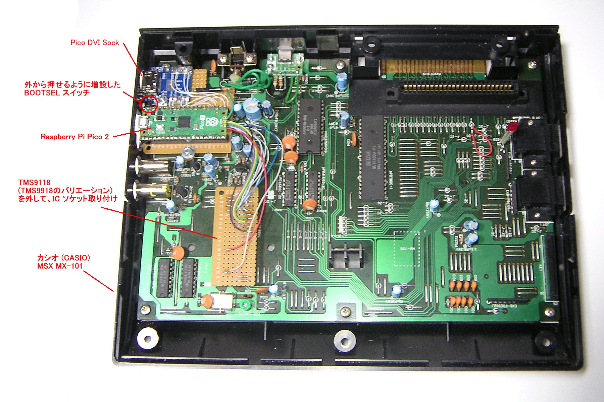
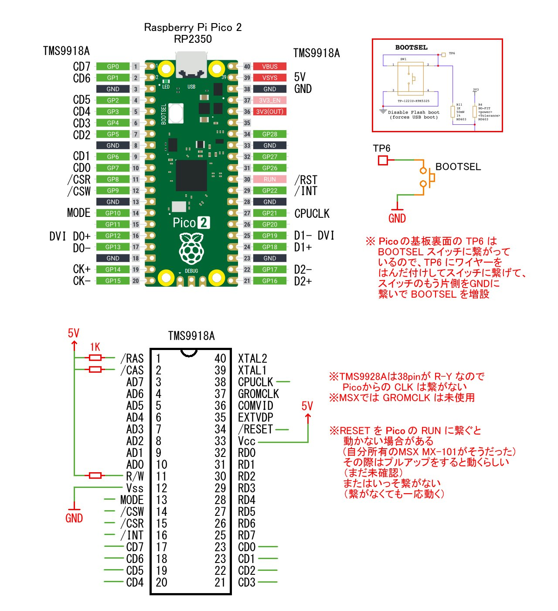
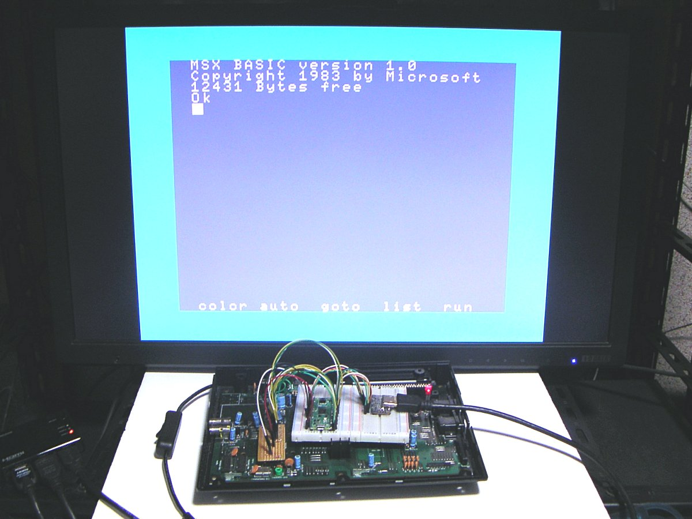
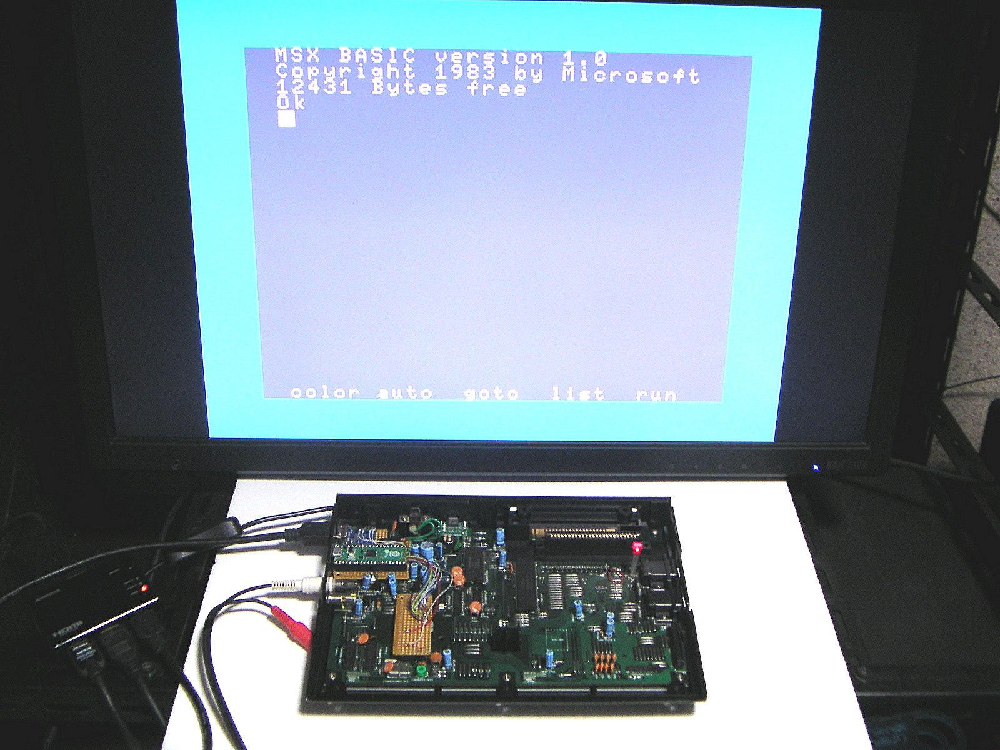
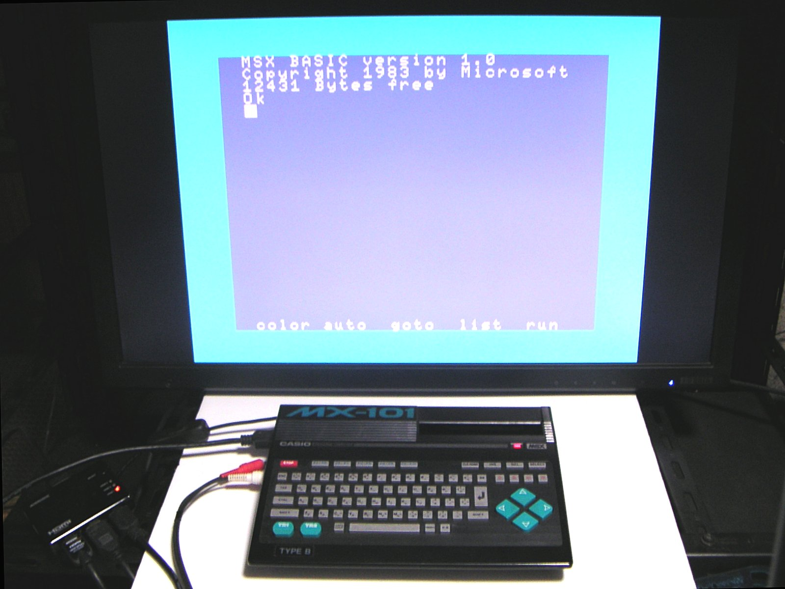

### PICO9918DVI ハードウェア

・オリジナルの PICO9918 の VGA 出力部分を、Pico DVI Sock に置き換えました。  
・オリジナルの PICO9918 は RP2040 を使用しているので、5V <-> 3.3V のレベル変換回路を搭載していますが、RP2350 が載っている Raspberry Pi Pico 2 を使用することで、レベルシフト回路を省略して、Raspberry Pi Pico 2 の GPIO を PC or ゲーム機のメイン基板に直接接続しています。  

   
今回のファームウェアでは以下のようなピン配置にしています。ピン配置はソースコードの書き換えで、条件がありますが変更できます。 
**※注意！！！：ピン配置を変えます！ちょっとまって！(April 3 2025)**  
   

### 注意事項
Raspberry Pi Pico の RP2040 の GPIO の入力電圧は 3.3V でしたが、Raspberry Pi Pico 2 の RP2350 シリーズのアナログ入力対応ピン以外の GPIO は、条件次第で(具体的にはIOVDD=3.3Vの時) 5.5Vまで入れても大丈夫な仕様になりました。(RP2350 Datasheet 1335page 参照)  
**RP2350 Datasheet:** [rp2350-datasheet.pdf](https://datasheets.raspberrypi.com/rp2350/rp2350-datasheet.pdf)
**14.9.1. Absolute Maximum Ratings** の Voltage at IO (FT) および **14.8.2.1. Pin Types** を読んでみてください。  
但し **IOVDD=3.3Vの時** という条件付きなので、**完全に 5Vトレラントという訳ではありません** 。  
しかし、とりあえず、今回は大丈夫だろうと、個人的には判断しました。( **ダメだったらごめんなさい** )  
MSX では GROMCLK は未使用です。また TMS9928A 搭載機では 38pin が CPUCLK ではなく R-Y なので、Pico 2 からの CLK は繋がないでください。  
RESET を Pico 2 の RUN に繋ぐと動かない場合があります(今回の私の MX-101 がそうでした)  
その場合はプルアップをすると動くらしいです(自分はまだ未確認)  
または、いっそ Pico 2 の RUN に何も繋がない。(今回の私の MX-101 ではそうしてます、一応問題なく動いています)  
Pico 2 を本体に内蔵すると、ファームウェアを再書き込みする際に Pico 2 の BOOTSEL ボタンが押せなくなってしまいます。  
Pico 2 の基板裏側の TP6 が BOOTSEL に繋がっているので、そこにワイヤーをはんだ付けして、スイッチの片側に繋ぎ、もう片側を GND に繋ぐことで、BOOTSEL を増設できます。  
家庭用テレビ等で PicoDVI の映像出力を HDMI入力端子に繋いでも映らない、という事象があるそうです。その際は Pico DVI Sock の側面にある 5V 端子に 5V or 3.3V を入れると認識されて映るらしいです(私は未遭遇未検証)  

**ハードウェアとしては単純に結線するだけなので、作る難易度はかなり低いと思います。部品代もお安いですし。誰か試してみませんか？**   

### その他の画像
  
ブレッドボード上で組んでみた状態  
  
Raspberry Pi Pico 2 と Pico DVI Sock をユニバーサル基板に載せて、MX-101 のRFユニットを取り除いた跡地に設置  
  
組み込み完了、MX-101 側面の DVI出力端子に HDMIケーブルを繋いで、そのまま直接 HDMIディスプレイに接続して映像を表示 
