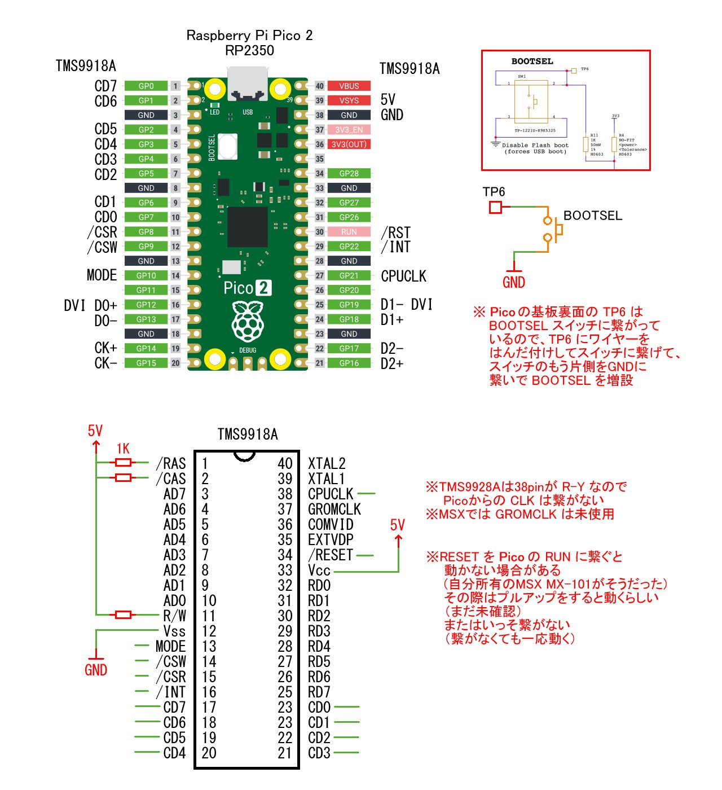

# PICO9918DVI for MSX

### 概要

これは、PICO9918 の VGA 部分を PicoDVI に交換して、HDMIディスプレイへの出力に対応させたものです。  

### PICO9918

PICO9918 は、Raspberry Pi Pico を使用して、昔のVDP TMS9918A を置き換えること (Drop-in replacement) を目的としたプロジェクトです。  
[Troy Schrapel](https://github.com/visrealm) 氏が開発しています。PICO9918 のプロジェクトのGitHubのページはこちら [pico9918](https://github.com/visrealm/pico9918)  
PICO9918 のTMS9918Aエミュレーションは、同じく Troy Schrapel 氏の [vrEmuts9918ライブラリ](https://github.com/visrealm/vrEmuTms9918) で処理されています。  
レトロゲーム機やレトロPCで使用されている VDP TMS9918A (TMS9918,TMS9928A,TMS9118 等) を PICO9918 に置き換えることによって、VGA (アナログRGB 31KHz) の映像出力が得られます。  
日本で TMS9918A シリーズを使っているレトロゲーム機やレトロPCは、セガ SG-1000,SC-3000, トミー ぴゅう太, ソード M5, 初代 MSX (MSX1) 等です。  
PICO9918 はオープンソースです。ファームウェアや基板のデータが公開されています。また Troy 氏が自ら製作した完成品のボードが海外のショップから購入出来ます(日本への発送が可能なショップです)。  

### PICO9918DVI for MSX

PICO9918 の VGA 部分を PicoDVI ライブラリに交換して、HDMIディスプレイへの出力に対応させてみました。  
Raspberry Pi Pico 2 を使用、レベルシフターを省略、直結します。  

### 注意事項

私の環境では、一応それなりに動いています。ですが動作保証はしません。ユーザーサポートもしません。使用は自己責任で。何か問題があっても自分で何とかしてください。  
私は商用のプログラムのコード等は書いたことが無い素人で初心者なので、多分、色々と間違っていると思います。 ここのソースコード内の私が書き代えた部分をプロの人やC/C++の熟練者が見たら「なんでこんなコードの書き方をするんだよ！」と怒りさえ覚える人がいるかもしれません。 もし居ましたら、これをフォークして、添削や清書をして頂ければと思います。  

### ハードウェア

   
   
